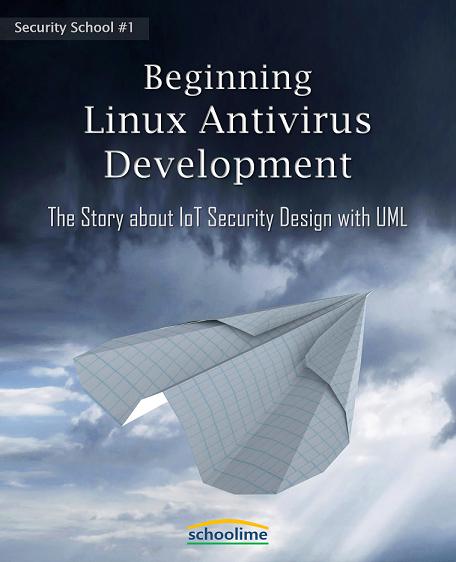
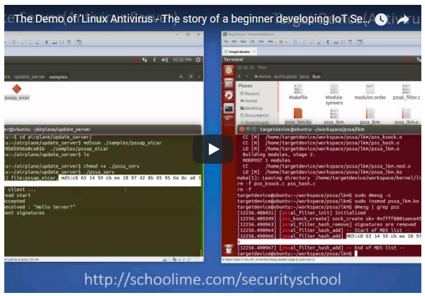

# Beginning Linux Antivirus Development: The Story about IoT Security Design UML

## This is the world’s first book that you have never read on how to develop security software
It is said that we are striding into the initial era of the internet of things, but I believe we are in the middle of the IoT now.
Smart watches, tablets for note-taking in class, Smart TVs allowing us to see popular soap dramas, game consoles to play games with your friends, e-books you read before you go to bed and smart phones you always look at to name but a few. We are using different types of computer systems which are all connected day and night. But, have you ever wondered how many gadgets among those things are applied to security technologies? In reality, not many devices are introduced to the technologies.
Also, many people say that security is important in the era of IoT while they tell us that it is essential that the vulnerability of IoT should be removed. So much so that, they focus on getting rid of vulnerabilities.
Of course, the concentration of vulnerability can’t be ruled out. But, adding a new feature to software breed another new vulnerability. Even so, security technologies for commercial antivirus programs can’t apply to all IoT devices. If that’s the case, what if IoT software developers create a security function for their devices on their own and apply it to theirs?
This is the first book that navigates you through the detail on how to develop security software functions.

## What you can get from this book.
While you are reading this book, you will find yourself to implement a simple antivirus software and an antivirus server by yourself. You may be still wondering if that is going to happen to you. You can check out a demo video as shown in the following. I am sure that you will be encouraged to do the same after watching it.

[Demo link of how the antivirus of this book works](http://schoolime.com/securityschool/antivirus/demo)

You might think that this book simply explain code like any other books. The answer is no. This is a story about a student with no experience in security who grows into a security software developer. Starting with a plausible hacking incident, the main character in this book collects requirement, draw a design and write code, so he goes through the entire process. You can also get the knowledge as below after you finish this book.
- The basics of antivirus structure
- Requirement-driven development
- Practical software design using UML
- How to modify kernels for security

## Don’t worry, any developers can read this book. You can be a security software developer.
Do you think those words are tricky for you? No worries. This book walks you through every process so that anyone who has the basic knowledge as below can easily understand the book. You will find yourself to be a security software developer after finishing this book.
- C programming
- Simple echo socket programing
- UML (It’s enough to heard of it. No necessary to handle it)
- The role of Linux kernels (No necessary to develop it)

## Where to buy
[Amazon Kindle](https://read.amazon.com/kp/embed?asin=B077VRYKYP&preview=newtab&linkCode=kpe&ref_=cm_sw_r_kb_dp_bFQiAbSA6W51A)
